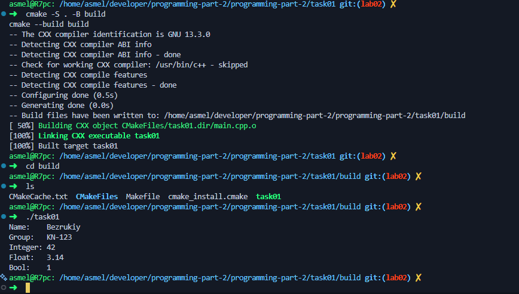
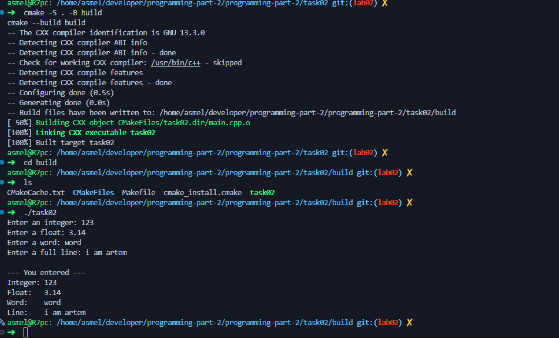
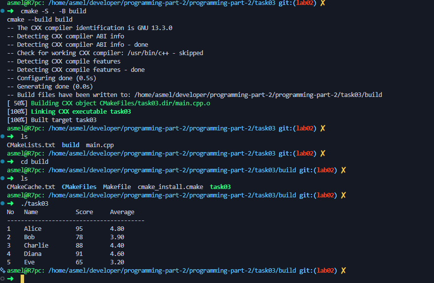
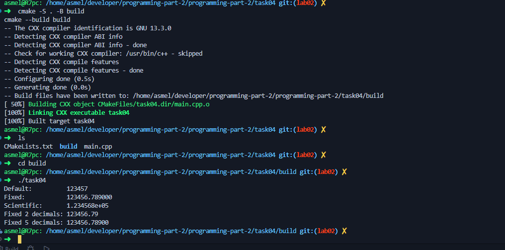
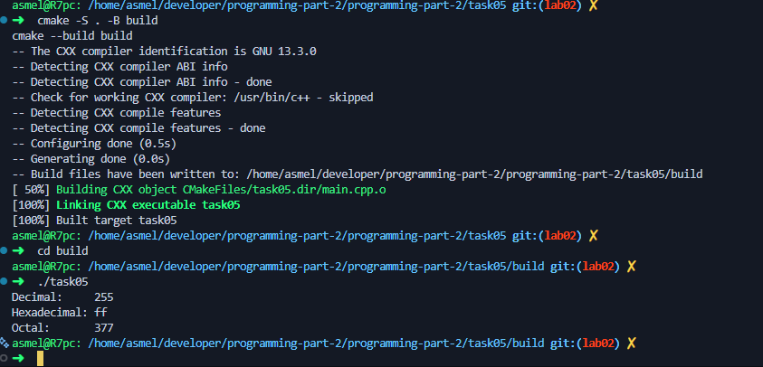
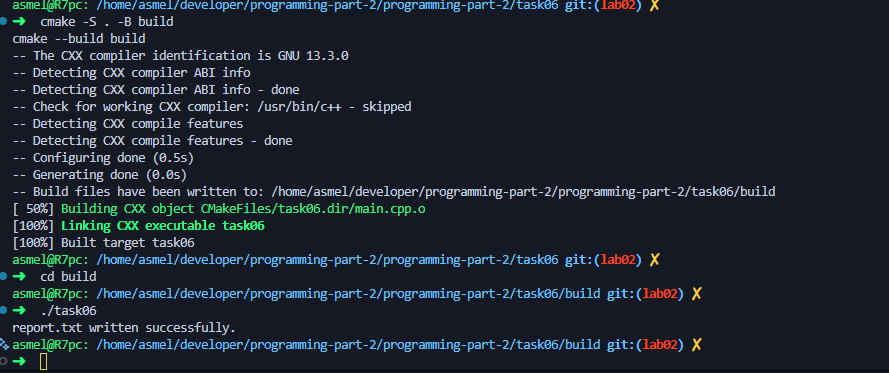
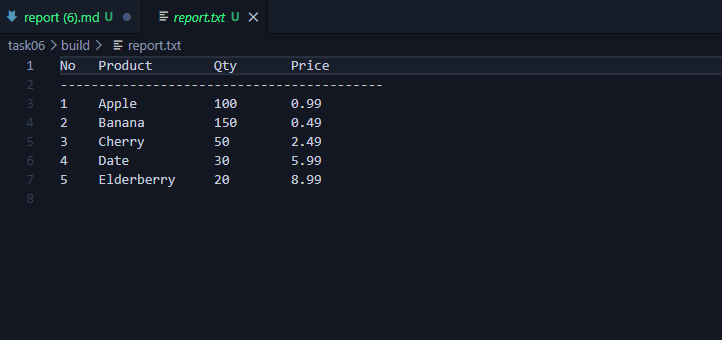
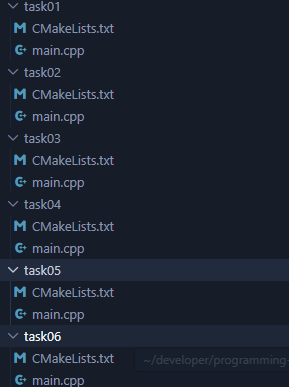

# Laboratory Work No. 2 — Text I/O, Formatting, and File Output

**Course:** Programming (Part 2). C++  
**Student:** Artem Smeliantsev  
**Group:** KN-925e 
**Branch:** `lab02`

---

## Topic

Text input and output, formatting, and file output in modern C++ using `<iostream>`, `<iomanip>`, `<fstream>`, and related facilities.

## Purpose

To develop practical skills in using text I/O facilities in modern C++, including stream manipulators for aligned formatted output, formatted output to text files, and the classical stream-based input model.

## Duration

90 minutes.

## Learning Outcomes

After completing this laboratory practice, students should be able to:
- Use `std::cout` for formatted console output.
- Use `std::cin` and `std::getline` for console input.
- Apply `<iomanip>` manipulators for column alignment and number formatting.
- Write formatted data to files using `std::ofstream`.

---

## 1. Brief Theoretical Background

### Stream Library in C++

C++ provides a stream-based I/O model. The most common standard streams are:
- `std::cin` — standard input;
- `std::cout` — standard output;
- `std::cerr` — standard error (unbuffered).

### `>>` vs. `std::getline`

The `>>` operator reads one token, stopping at the first whitespace. To read a full line including spaces, use `std::getline(std::cin, str)`. When mixing `>>` with `getline`, the newline left in the buffer must be discarded first:

```cpp
std::cin.ignore(std::numeric_limits<std::streamsize>::max(), '\n');
```

### Key `<iomanip>` Manipulators

| Manipulator | Effect |
|-------------|--------|
| `std::setw(n)` | Field width for the next value |
| `std::setfill(c)` | Fill character (default: space) |
| `std::left` / `std::right` | Text alignment |
| `std::fixed` / `std::scientific` | Floating-point notation |
| `std::setprecision(n)` | Number of decimal digits |
| `std::hex` / `std::oct` / `std::dec` | Integer output base |
| `std::boolalpha` | Print `true`/`false` instead of `1`/`0` |

### File Output — `std::ofstream`

`std::ofstream` from `<fstream>` supports the same manipulators as `std::cout`. Data is written to a file in exactly the same way as to the console.

---

## 2. Project Structure

Each task is implemented as an independent CMake project in its own directory:

```
lab02/
├── task01/  ← Basic console output
├── task02/  ← Basic console input
├── task03/  ← Table formatting with <iomanip>
├── task04/  ← Floating-point formatting
├── task05/  ← Integer formatting
└── task06/  ← Formatted output to a text file
```

Every task directory contains a `CMakeLists.txt` and `main.cpp` and can be configured and built independently.

---

## 3. Tasks

### Task 1 — Basic Console Output

Output name, group, an integer, a float, and a bool with descriptive labels.

**`task01/CMakeLists.txt`:**
```cmake
cmake_minimum_required(VERSION 3.20)
project(task01 LANGUAGES CXX)
add_executable(task01 main.cpp)
target_compile_features(task01 PRIVATE cxx_std_20)
if(MSVC)
    target_compile_options(task01 PRIVATE /W4)
else()
    target_compile_options(task01 PRIVATE -Wall -Wextra -Wpedantic)
endif()
```

**`task01/main.cpp`:**
```cpp
#include <iostream>

int main() {
    std::cout << "Name:    Bezrukiy\n";
    std::cout << "Group:   KN-123\n";
    std::cout << "Integer: " << 42 << "\n";
    std::cout << "Float:   " << 3.14 << "\n";
    std::cout << "Bool:    " << true << "\n";
    return 0;
}
```

**Output:**
```
Name:    Bezrukiy
Group:   KN-123
Integer: 42
Float:   3.14
Bool:    1
```
---

### Task 2 — Basic Console Input

Read an integer, a float, a word, and a full line; echo them back.

**`task02/main.cpp`:**
```cpp
#include <iostream>
#include <string>
#include <limits>

int main() {
    int i;
    double d;
    std::string word;
    std::string line;

    std::cout << "Enter an integer: ";
    std::cin >> i;

    std::cout << "Enter a float: ";
    std::cin >> d;

    std::cout << "Enter a word: ";
    std::cin >> word;

    std::cin.ignore(std::numeric_limits<std::streamsize>::max(), '\n');

    std::cout << "Enter a full line: ";
    std::getline(std::cin, line);

    std::cout << "\n--- You entered ---\n";
    std::cout << "Integer: " << i    << "\n";
    std::cout << "Float:   " << d    << "\n";
    std::cout << "Word:    " << word << "\n";
    std::cout << "Line:    " << line << "\n";
    return 0;
}
```

**Note:** `std::cin.ignore(...)` is called between the `>>` extraction and `getline` to discard the newline character that `>>` leaves in the input buffer.


---

### Task 3 — Table Formatting with `<iomanip>`

Output a formatted 5-row table (index, name, score, average) using `std::setw` and alignment manipulators.

**`task03/main.cpp`:**
```cpp
#include <iostream>
#include <iomanip>

int main() {
    std::cout << std::left
              << std::setw(5)  << "No"
              << std::setw(15) << "Name"
              << std::setw(10) << "Score"
              << std::setw(10) << "Average"
              << "\n";
    std::cout << std::string(40, '-') << "\n";

    struct Row { int id; const char* name; int score; double avg; };
    Row rows[] = {
        {1, "Alice",   95, 4.8},
        {2, "Bob",     78, 3.9},
        {3, "Charlie", 88, 4.4},
        {4, "Diana",   91, 4.6},
        {5, "Eve",     65, 3.2},
    };

    for (auto& r : rows) {
        std::cout << std::left
                  << std::setw(5)  << r.id
                  << std::setw(15) << r.name
                  << std::setw(10) << r.score
                  << std::fixed << std::setprecision(2)
                  << std::setw(10) << r.avg
                  << "\n";
    }
    return 0;
}
```

**Output:**
```
No   Name           Score     Average
----------------------------------------
1    Alice          95        4.80
2    Bob            78        3.90
3    Charlie        88        4.40
4    Diana          91        4.60
5    Eve            65        3.20
```



---

### Task 4 — Floating-Point Formatting

Print the same float in five different formats.

**`task04/main.cpp`:**
```cpp
#include <iostream>
#include <iomanip>

int main() {
    double val = 123456.789;

    std::cout << "Default:          " << val << "\n";
    std::cout << "Fixed:            " << std::fixed      << val << "\n";
    std::cout << "Scientific:       " << std::scientific << val << "\n";
    std::cout << "Fixed 2 decimals: " << std::fixed << std::setprecision(2) << val << "\n";
    std::cout << "Fixed 5 decimals: " << std::fixed << std::setprecision(5) << val << "\n";
    return 0;
}
```

**Output:**
```
Default:          123457
Fixed:            123456.789000
Scientific:       1.234568e+05
Fixed 2 decimals: 123456.79
Fixed 5 decimals: 123456.78900
```

`std::fixed` keeps the decimal point at a fixed position. `std::scientific` switches to exponential notation. `std::setprecision` controls the number of digits after the decimal point in `fixed` / `scientific` mode.


---

### Task 5 — Integer Formatting

Print the same integer in decimal, hexadecimal, and octal.

**`task05/main.cpp`:**
```cpp
#include <iostream>

int main() {
    int val = 255;

    std::cout << "Decimal:     " << std::dec << val << "\n";
    std::cout << "Hexadecimal: " << std::hex << val << "\n";
    std::cout << "Octal:       " << std::oct << val << "\n";
    return 0;
}
```

**Output:**
```
Decimal:     255
Hexadecimal: ff
Octal:       377
```



---

### Task 6 — Formatted Output to a Text File

Create a formatted product table with 5 rows and 4 columns in a file.

**`task06/main.cpp`:**
```cpp
#include <fstream>
#include <iomanip>
#include <iostream>

int main() {
    std::ofstream f("report.txt");
    if (!f) {
        std::cerr << "Failed to open file\n";
        return 1;
    }

    f << std::left
      << std::setw(5)  << "No"
      << std::setw(15) << "Product"
      << std::setw(10) << "Qty"
      << std::setw(12) << "Price"
      << "\n";
    f << std::string(42, '-') << "\n";

    struct Item { int id; const char* name; int qty; double price; };
    Item items[] = {
        {1, "Apple",      100, 0.99},
        {2, "Banana",     150, 0.49},
        {3, "Cherry",      50, 2.49},
        {4, "Date",        30, 5.99},
        {5, "Elderberry",  20, 8.99},
    };

    for (auto& item : items) {
        f << std::left
          << std::setw(5)  << item.id
          << std::setw(15) << item.name
          << std::setw(10) << item.qty
          << std::fixed << std::setprecision(2)
          << std::setw(12) << item.price
          << "\n";
    }

    f.close();
    std::cout << "report.txt written successfully.\n";
    return 0;
}
```

**Generated `report.txt`:**
```
No   Product        Qty       Price
------------------------------------------
1    Apple          100       0.99
2    Banana         150       0.49
3    Cherry         50        2.49
4    Date           30        5.99
5    Elderberry     20        8.99
```

`std::ofstream` supports all `<iomanip>` manipulators identically to `std::cout`. The file stream is closed explicitly with `f.close()`, though it would also be closed automatically by the destructor.



---

## 4. Comparison of Output Methods

| Method | Library | Readability | Type Safety | Version |
|--------|---------|-------------|-------------|---------|
| `std::cout` + `<iomanip>` | `<iostream>` | Verbose for complex layouts | Yes | C++98+ |
| `std::format` | `<format>` | Concise, Python-style | Yes (compile-time) | C++20 |
| `std::println` | `<print>` | Most concise | Yes (compile-time) | C++23 |

For Tasks 1–6 the classical `std::cout` + `<iomanip>` approach was used, as it is the primary topic of this lab.

---

## 5. Screenshots


---

## 6. Conclusions

In this laboratory work the following was completed:

- Six independent CMake projects were created following the required directory naming convention (`task01`–`task06`).
- `std::cout` was used for formatted console output with descriptive labels.
- `std::cin` and `std::getline` were used for reading mixed input; the `ignore()` call was applied to flush the leftover newline between `>>` and `getline`.
- `<iomanip>` manipulators (`setw`, `left`, `fixed`, `setprecision`, `hex`, `oct`) were applied to produce aligned tables and consistently formatted numbers.
- `std::ofstream` was used to write a formatted product table to a text file, demonstrating that the same formatting manipulators work identically on file streams.
- The main observation is that `std::cout` with `<iomanip>` becomes verbose for complex layouts, which motivates the modern `std::format` approach introduced in C++20.

---
