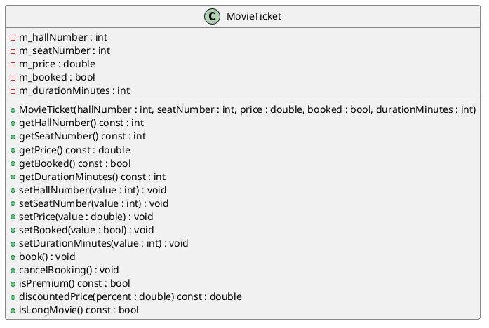
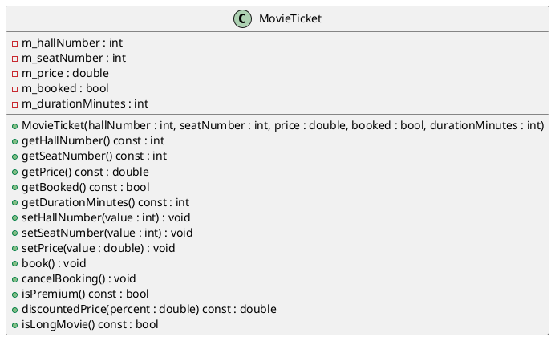

# Laboratory Work No. 3 — A Simple C++ Class and UML Basics

**Course:** Programming (Part 2). C++  
**Student:** Smeliantsev Artem  
**Group:** KN-925e 
**Branch:** `lab03`

---

## Topic

Designing a simple C++ class with private fields, constructor, getters/setters, and behavioral methods. Creating a UML class diagram with PlantUML. Critically analysing the public interface.

## Purpose

To acquire practical skills in designing a simple C++ class, applying encapsulation principles, creating UML class diagrams, and evaluating the quality of a public interface.

## Duration

90 minutes.

## Learning Outcomes

After completing this laboratory work, the student should be able to:
- Declare a class in C++ with private fields and a public interface.
- Implement a constructor with validation, getters, and setters.
- Create a UML class diagram using PlantUML.
- Analyse which getters and setters are unnecessary and propose a simplified interface.

---

## 1. Brief Theoretical Notes

### Class in C++

A class is a user-defined type that encapsulates data (fields) and behaviour (methods). Access modifiers restrict visibility: `private` members are accessible only from within the class, `public` members form the external interface.

### Encapsulation

Encapsulation means hiding internal state behind a well-defined interface. Making fields `private` reduces coupling, protects invariants, and makes the class easier to maintain.

### Getters and Setters

Getters (accessors) return field values; setters (mutators) modify them. Not every field needs a setter. A raw setter that accepts any value can violate class invariants and expose unnecessary internal state. A purpose-built method (e.g., `book()` instead of `setBooked(true)`) is often more intention-revealing and harder to misuse.

### UML Class Diagram Notation

- `-` private member, `+` public member
- Format: `+ methodName(param : Type) : ReturnType`
- Fields listed in the middle compartment; methods in the bottom compartment.

---

## 2. Variant Specification — Variant 12: MovieTicket

**Class:** `MovieTicket`

**Fields:**

| Field | Type | Description |
|-------|------|-------------|
| `m_hallNumber` | `int` | Cinema hall number (must be > 0) |
| `m_seatNumber` | `int` | Seat number within the hall (must be > 0) |
| `m_price` | `double` | Ticket price (must be ≥ 0.0) |
| `m_booked` | `bool` | Whether the ticket is currently booked |
| `m_durationMinutes` | `int` | Film duration in minutes (must be > 0) |

**Main methods:**

| Method | Description |
|--------|-------------|
| `book()` | Sets `m_booked = true` |
| `cancelBooking()` | Sets `m_booked = false` |
| `isPremium()` | Returns `true` if hall ≥ 3 AND price ≥ 15.0 |
| `discountedPrice(percent)` | Returns price after applying a % discount; clamps percent to [0, 100] |
| `isLongMovie()` | Returns `true` if duration > 120 minutes |

---

## 3. Project Directory Structure

```
lab03/
├── CMakeLists.txt
├── include/
│   └── MovieTicket.hpp
├── src/
│   ├── MovieTicket.cpp
│   └── main.cpp
└── uml/
    └── MovieTicket.puml
```

---

## 4. Initial UML Class Diagram


**PlantUML source (`uml/MovieTicket.puml`):**



---

## 5. Implementation

### Header file (`include/MovieTicket.hpp`)

```cpp
#pragma once

class MovieTicket {
public:
    MovieTicket(int hallNumber, int seatNumber, double price,
                bool booked, int durationMinutes);

    int    getHallNumber()      const;
    int    getSeatNumber()      const;
    double getPrice()           const;
    bool   getBooked()          const;
    int    getDurationMinutes() const;

    void setHallNumber(int value);
    void setSeatNumber(int value);
    void setPrice(double value);
    void setBooked(bool value);
    void setDurationMinutes(int value);

    void   book();
    void   cancelBooking();
    bool   isPremium()                     const;
    double discountedPrice(double percent) const;
    bool   isLongMovie()                   const;

private:
    int    m_hallNumber;
    int    m_seatNumber;
    double m_price;
    bool   m_booked;
    int    m_durationMinutes;
};
```

### Implementation file (`src/MovieTicket.cpp`)

```cpp
#include "MovieTicket.hpp"

MovieTicket::MovieTicket(int hallNumber, int seatNumber, double price,
                         bool booked, int durationMinutes)
    : m_hallNumber(hallNumber > 0 ? hallNumber : 1),
      m_seatNumber(seatNumber > 0 ? seatNumber : 1),
      m_price(price >= 0.0 ? price : 0.0),
      m_booked(booked),
      m_durationMinutes(durationMinutes > 0 ? durationMinutes : 0) {}

int    MovieTicket::getHallNumber()      const { return m_hallNumber; }
int    MovieTicket::getSeatNumber()      const { return m_seatNumber; }
double MovieTicket::getPrice()           const { return m_price; }
bool   MovieTicket::getBooked()          const { return m_booked; }
int    MovieTicket::getDurationMinutes() const { return m_durationMinutes; }

void MovieTicket::setHallNumber(int value)      { if (value > 0)    m_hallNumber = value; }
void MovieTicket::setSeatNumber(int value)      { if (value > 0)    m_seatNumber = value; }
void MovieTicket::setPrice(double value)        { if (value >= 0.0) m_price = value; }
void MovieTicket::setBooked(bool value)         { m_booked = value; }
void MovieTicket::setDurationMinutes(int value) { if (value > 0)    m_durationMinutes = value; }

void MovieTicket::book()          { m_booked = true; }
void MovieTicket::cancelBooking() { m_booked = false; }

bool MovieTicket::isPremium() const {
    return m_hallNumber >= 3 && m_price >= 15.0;
}

double MovieTicket::discountedPrice(double percent) const {
    if (percent < 0.0)   percent = 0.0;
    if (percent > 100.0) percent = 100.0;
    return m_price * (1.0 - percent / 100.0);
}

bool MovieTicket::isLongMovie() const {
    return m_durationMinutes > 120;
}
```

### Test program (`src/main.cpp`)

```cpp
#include <iostream>
#include "MovieTicket.hpp"

int main() {
    MovieTicket ticket(2, 14, 12.50, false, 148);

    std::cout << "=== MovieTicket Info ===\n";
    std::cout << "Hall:     " << ticket.getHallNumber() << "\n";
    std::cout << "Seat:     " << ticket.getSeatNumber() << "\n";
    std::cout << "Price:    " << ticket.getPrice() << "\n";
    std::cout << "Booked:   " << (ticket.getBooked() ? "yes" : "no") << "\n";
    std::cout << "Duration: " << ticket.getDurationMinutes() << " min\n";

    std::cout << "\n=== Methods ===\n";
    std::cout << "Is premium:  " << (ticket.isPremium() ? "yes" : "no") << "\n";
    std::cout << "Is long:     " << (ticket.isLongMovie() ? "yes" : "no") << "\n";
    std::cout << "Price -20%:  " << ticket.discountedPrice(20.0) << "\n";

    ticket.book();
    std::cout << "\nAfter book(): booked = " << (ticket.getBooked() ? "yes" : "no") << "\n";

    ticket.cancelBooking();
    std::cout << "After cancelBooking(): booked = " << (ticket.getBooked() ? "yes" : "no") << "\n";

    ticket.setHallNumber(5);
    ticket.setPrice(18.0);
    std::cout << "\nAfter hall=5, price=18.0:\n";
    std::cout << "Is premium: " << (ticket.isPremium() ? "yes" : "no") << "\n";
    std::cout << "Price -10%: " << ticket.discountedPrice(10.0) << "\n";

    return 0;
}
```

**Program output:**
```
=== MovieTicket Info ===
Hall:     2
Seat:     14
Price:    12.5
Booked:   no
Duration: 148 min

=== Methods ===
Is premium:  no
Is long:     yes
Price -20%:  10

After book(): booked = yes
After cancelBooking(): booked = no

After hall=5, price=18.0:
Is premium: yes
Price -10%: 16.2
```


---

## 6. Program Testing

The `main()` function demonstrates:
1. Object construction with a non-premium ticket (hall 2, price 12.50, duration 148 min).
2. Reading all fields via getters to verify initial state.
3. Calling `isPremium()`, `isLongMovie()`, and `discountedPrice(20.0)`.
4. Calling `book()` and `cancelBooking()` to verify the booking state cycle.
5. Using `setHallNumber(5)` and `setPrice(18.0)` to move to a premium configuration and re-checking `isPremium()`.

---

## 7. Which Getters and Setters Are Unnecessary Here, and Why

> **This section is mandatory.**

### Methods identified as unnecessary or questionable

| Method | Reason |
|--------|--------|
| `setBooked(bool value)` | Raw boolean exposure. The class already provides `book()` and `cancelBooking()` which express intent clearly and cannot be misused (no intermediate invalid state). A caller who writes `setBooked(true)` conveys no semantic information, while `book()` is self-documenting. |
| `setDurationMinutes(int value)` | Film duration is a property of the movie, not of the booking process. Once a ticket is issued, the duration should not change. Exposing a setter creates the risk of inconsistent data (e.g., a ticket that says the film is 90 min when it is actually 180 min). |

### Proposed better interface

- **Remove** `setBooked(bool)` — `book()` and `cancelBooking()` already cover all legitimate state transitions.
- **Remove** `setDurationMinutes(int)` — duration should be fixed at construction time and considered immutable.

```cpp
// Instead of:
ticket.setBooked(true);

// Prefer:
ticket.book();   // intent is explicit and the transition is named
```

---

## 8. Updated UML Class Diagram (Simplified Interface)


**Changes from the initial diagram:**
- Removed: `setBooked(value : bool)` — replaced entirely by `book()` and `cancelBooking()`.
- Removed: `setDurationMinutes(value : int)` — duration is immutable after construction.

i might have changed smth else, but i forgot sadly and i am too lazy to check.



---

## 9. Assessment Criteria Summary

| Criterion | Points |
|-----------|--------|
| Correct class declaration, access modifiers, private fields | 15 |
| Presence and correctness of constructor, getters, and setters | 15 |
| Implementation of all main methods from the variant | 20 |
| Working `main()` that demonstrates the functionality | 10 |
| Correct PlantUML class diagram and generated image file | 15 |
| Quality of the report and correspondence between code and spec | 10 |
| Analysis of unnecessary getters/setters and new UML diagram | 15 |
| **Total** | **100** |

---

## 10. Conclusions

In this laboratory work the following was completed:

- The `MovieTicket` class was designed with five private fields and a full constructor that validates each argument (negative or zero values are replaced with safe defaults).
- A complete public interface was implemented: five getters, five setters, and five behavioral methods.
- A UML class diagram was created in PlantUML notation and converted to an image.
- Analysis showed that `setBooked` is redundant because `book()` / `cancelBooking()` already provide clear, intent-revealing alternatives, and that `setDurationMinutes` should be removed because film duration is logically immutable after a ticket is issued.
- A simplified UML diagram was produced reflecting these improvements.

---
