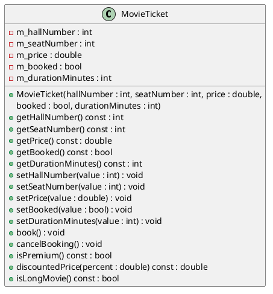

# Laboratory Work No. 4 — Simple Classes and Unit Testing

**Course:** Programming (Part 2). C++  
**Student:** Smeliantsev Artem  
**Group:** KN-925e   
**Branch:** `lab04`

---

## Topic

Organising a C++ class as a separate CMake library target, writing automated unit tests with GoogleTest, and running them through CTest.

## Purpose

To acquire practical skills in separating a class implementation into a reusable library, writing automated unit tests, and integrating the test target into a CMake project.

## Duration

90 minutes.

## Learning Outcomes

After completing this laboratory work, the student should be able to:
- Organise a C++ class as a static library in CMake.
- Write unit tests using GoogleTest (`TEST`, `EXPECT_*`, `ASSERT_*`).
- Configure a dedicated test target in `CMakeLists.txt`.
- Run tests with `ctest` and interpret pass/fail results.

---

## 1. Brief Theoretical Notes

### Why Testing Matters

Manual execution of a program can only verify one scenario at a time. Automated unit tests verify individual units of code in isolation, cover boundary cases, and can be re-run after every change to catch regressions immediately.

### Types of Tests

| Type | Scope | Typical author |
|------|-------|----------------|
| Unit | Single class / function | Developer |
| Integration | Interaction between components | Developer / QA |
| Functional | System behaviour from user perspective | QA / product |

### Why Organise a Class as a Library?

A separate CMake library target compiles the class code once. Both the application executable and the test executable link against the same compiled object, ensuring that tests exercise the exact code that ships.

### GoogleTest Basics

```cpp
TEST(SuiteName, TestName) {
    EXPECT_EQ(actual, expected);       // soft: test continues on failure
    EXPECT_DOUBLE_EQ(a, b);
    EXPECT_TRUE(condition);
    ASSERT_NE(ptr, nullptr);           // hard: test stops on failure
}
```

---

## 2. Variant Specification — Variant 12: MovieTicket

Same class as in Lab 03. The key change is that the class is now compiled as a library (`movieticket`) and tested with a comprehensive GoogleTest suite.

**Class:** `MovieTicket`  
**Fields:** `m_hallNumber`, `m_seatNumber`, `m_price`, `m_booked`, `m_durationMinutes`  
**Methods:** `book()`, `cancelBooking()`, `isPremium()`, `discountedPrice()`, `isLongMovie()`

---

## 3. CMake Project Structure

```
lab04/
├── CMakeLists.txt        ← library + app + test targets
├── include/
│   └── MovieTicket.hpp
├── src/
│   ├── MovieTicket.cpp
│   └── main.cpp
├── tests/
│   └── test_movieticket.cpp
└── uml/
    └── MovieTicket.puml
```

---

## 4. `CMakeLists.txt`

```cmake
cmake_minimum_required(VERSION 3.20)
project(lab04 LANGUAGES CXX)

include(FetchContent)
FetchContent_Declare(
    googletest
    GIT_REPOSITORY https://github.com/google/googletest.git
    GIT_TAG v1.17.0
)
FetchContent_MakeAvailable(googletest)

enable_testing()

# ── Library ───────────────────────────────────────────────────────────────────
add_library(movieticket src/MovieTicket.cpp)
target_include_directories(movieticket PUBLIC include)
target_compile_features(movieticket PUBLIC cxx_std_20)
if(MSVC)
    target_compile_options(movieticket PRIVATE /W4)
else()
    target_compile_options(movieticket PRIVATE -Wall -Wextra -Wpedantic)
endif()

# ── Application ───────────────────────────────────────────────────────────────
add_executable(lab04_app src/main.cpp)
target_link_libraries(lab04_app PRIVATE movieticket)

# ── Tests ─────────────────────────────────────────────────────────────────────
add_executable(lab04_tests tests/test_movieticket.cpp)
target_link_libraries(lab04_tests PRIVATE movieticket GTest::gtest_main)

include(GoogleTest)
gtest_discover_tests(lab04_tests)
```

---

## 5. UML Class Diagram



---

## 6. Implementation (Library)

The implementation files are identical to Lab 03. See `include/MovieTicket.hpp` and `src/MovieTicket.cpp` above. The key structural difference is that the class is now compiled as a **static library** (`add_library(movieticket ...)`) instead of directly into the executable.

---

## 7. Demonstration `main.cpp`

```cpp
#include <iostream>
#include "MovieTicket.hpp"

int main() {
    MovieTicket ticket(2, 14, 12.50, false, 148);

    std::cout << "=== MovieTicket Info ===\n";
    std::cout << "Hall:     " << ticket.getHallNumber() << "\n";
    std::cout << "Seat:     " << ticket.getSeatNumber() << "\n";
    std::cout << "Price:    " << ticket.getPrice() << "\n";
    std::cout << "Booked:   " << (ticket.getBooked() ? "yes" : "no") << "\n";
    std::cout << "Duration: " << ticket.getDurationMinutes() << " min\n";

    std::cout << "\n=== Methods ===\n";
    std::cout << "Is premium:  " << (ticket.isPremium() ? "yes" : "no") << "\n";
    std::cout << "Is long:     " << (ticket.isLongMovie() ? "yes" : "no") << "\n";
    std::cout << "Price -20%:  " << ticket.discountedPrice(20.0) << "\n";

    ticket.book();
    std::cout << "\nAfter book(): booked = " << (ticket.getBooked() ? "yes" : "no") << "\n";

    ticket.cancelBooking();
    std::cout << "After cancelBooking(): booked = " << (ticket.getBooked() ? "yes" : "no") << "\n";

    ticket.setHallNumber(5);
    ticket.setPrice(18.0);
    std::cout << "\nAfter hall=5, price=18.0:\n";
    std::cout << "Is premium: " << (ticket.isPremium() ? "yes" : "no") << "\n";
    std::cout << "Price -10%: " << ticket.discountedPrice(10.0) << "\n";

    return 0;
}
```


---

## 8. Unit Tests (`tests/test_movieticket.cpp`)

The test suite contains 24 tests across 7 groups:

```cpp
#include <gtest/gtest.h>
#include "MovieTicket.hpp"

// ── Constructor ──────────────────────────────────────────────────────────────

TEST(MovieTicketConstructorTest, StoresValidValues) {
    MovieTicket t(2, 14, 12.50, false, 148);
    EXPECT_EQ(t.getHallNumber(), 2);
    EXPECT_EQ(t.getSeatNumber(), 14);
    EXPECT_DOUBLE_EQ(t.getPrice(), 12.50);
    EXPECT_FALSE(t.getBooked());
    EXPECT_EQ(t.getDurationMinutes(), 148);
}

TEST(MovieTicketConstructorTest, InvalidHallDefaultsToOne) {
    MovieTicket t(-3, 5, 10.0, false, 90);
    EXPECT_EQ(t.getHallNumber(), 1);
}

TEST(MovieTicketConstructorTest, InvalidSeatDefaultsToOne) {
    MovieTicket t(1, 0, 10.0, false, 90);
    EXPECT_EQ(t.getSeatNumber(), 1);
}

TEST(MovieTicketConstructorTest, NegativePriceDefaultsToZero) {
    MovieTicket t(1, 1, -5.0, false, 90);
    EXPECT_DOUBLE_EQ(t.getPrice(), 0.0);
}

TEST(MovieTicketConstructorTest, InvalidDurationDefaultsToZero) {
    MovieTicket t(1, 1, 10.0, false, -10);
    EXPECT_EQ(t.getDurationMinutes(), 0);
}

// ── Getters and Setters ──────────────────────────────────────────────────────

TEST(MovieTicketGetterSetterTest, SetHallNumberValid) {
    MovieTicket t(1, 1, 10.0, false, 90);
    t.setHallNumber(5);
    EXPECT_EQ(t.getHallNumber(), 5);
}

TEST(MovieTicketGetterSetterTest, SetHallNumberIgnoresInvalid) {
    MovieTicket t(2, 1, 10.0, false, 90);
    t.setHallNumber(-1);
    EXPECT_EQ(t.getHallNumber(), 2);
}

TEST(MovieTicketGetterSetterTest, SetPriceValid) {
    MovieTicket t(1, 1, 10.0, false, 90);
    t.setPrice(20.0);
    EXPECT_DOUBLE_EQ(t.getPrice(), 20.0);
}

TEST(MovieTicketGetterSetterTest, SetPriceIgnoresNegative) {
    MovieTicket t(1, 1, 10.0, false, 90);
    t.setPrice(-5.0);
    EXPECT_DOUBLE_EQ(t.getPrice(), 10.0);
}

// ── book() / cancelBooking() ─────────────────────────────────────────────────

TEST(MovieTicketMethodTest, BookSetsBookedTrue) {
    MovieTicket t(1, 1, 10.0, false, 90);
    t.book();
    EXPECT_TRUE(t.getBooked());
}

TEST(MovieTicketMethodTest, CancelBookingSetsBookedFalse) {
    MovieTicket t(1, 1, 10.0, true, 90);
    t.cancelBooking();
    EXPECT_FALSE(t.getBooked());
}

TEST(MovieTicketMethodTest, BookThenCancelCycle) {
    MovieTicket t(1, 1, 10.0, false, 90);
    t.book();
    EXPECT_TRUE(t.getBooked());
    t.cancelBooking();
    EXPECT_FALSE(t.getBooked());
}

// ── isPremium() ──────────────────────────────────────────────────────────────

TEST(MovieTicketMethodTest, IsPremiumTrueWhenHallAndPriceQualify) {
    MovieTicket t(3, 1, 15.0, false, 90);
    EXPECT_TRUE(t.isPremium());
}

TEST(MovieTicketMethodTest, IsPremiumFalseWhenHallTooLow) {
    MovieTicket t(2, 1, 20.0, false, 90);
    EXPECT_FALSE(t.isPremium());
}

TEST(MovieTicketMethodTest, IsPremiumFalseWhenPriceTooLow) {
    MovieTicket t(5, 1, 14.99, false, 90);
    EXPECT_FALSE(t.isPremium());
}

// ── discountedPrice() ────────────────────────────────────────────────────────

TEST(MovieTicketMethodTest, DiscountedPriceTwentyPercent) {
    MovieTicket t(1, 1, 10.0, false, 90);
    EXPECT_DOUBLE_EQ(t.discountedPrice(20.0), 8.0);
}

TEST(MovieTicketMethodTest, DiscountedPriceZeroPercent) {
    MovieTicket t(1, 1, 10.0, false, 90);
    EXPECT_DOUBLE_EQ(t.discountedPrice(0.0), 10.0);
}

TEST(MovieTicketMethodTest, DiscountedPriceHundredPercent) {
    MovieTicket t(1, 1, 10.0, false, 90);
    EXPECT_DOUBLE_EQ(t.discountedPrice(100.0), 0.0);
}

// ── isLongMovie() ────────────────────────────────────────────────────────────

TEST(MovieTicketMethodTest, IsLongMovieTrueAbove120) {
    MovieTicket t(1, 1, 10.0, false, 121);
    EXPECT_TRUE(t.isLongMovie());
}

TEST(MovieTicketMethodTest, IsLongMovieFalseAt120) {
    MovieTicket t(1, 1, 10.0, false, 120);
    EXPECT_FALSE(t.isLongMovie());
}

// ── Boundary cases ───────────────────────────────────────────────────────────

TEST(MovieTicketBoundaryTest, ExactPremiumHallAndPrice) {
    MovieTicket t(3, 1, 15.0, false, 90);
    EXPECT_TRUE(t.isPremium());  // exactly at threshold
}

TEST(MovieTicketBoundaryTest, DiscountClampedAbove100) {
    MovieTicket t(1, 1, 10.0, false, 90);
    EXPECT_DOUBLE_EQ(t.discountedPrice(150.0), 0.0);
}

TEST(MovieTicketBoundaryTest, DiscountClampedBelow0) {
    MovieTicket t(1, 1, 10.0, false, 90);
    EXPECT_DOUBLE_EQ(t.discountedPrice(-10.0), 10.0);
}
```

---

## 9. Test Scenario Descriptions

| Test group | Tests | What is verified |
|-----------|-------|-----------------|
| Constructor | 5 | Valid values are stored; invalid hall/seat/price/duration are replaced with safe defaults |
| Getters & Setters | 5 | Setters accept valid values and silently ignore invalid ones |
| `book()` / `cancelBooking()` | 3 | State transitions work correctly, including a full book→cancel cycle |
| `isPremium()` | 3 | All four quadrants of the two-condition logic (hall < 3 / ≥ 3, price < 15 / ≥ 15) |
| `discountedPrice()` | 3 | Normal discount, zero discount, full 100% discount |
| `isLongMovie()` | 2 | Duration > 120 returns `true`; duration == 120 returns `false` |
| Boundary cases | 3 | Exact threshold for premium, clamping discount above 100 and below 0 |

---

## 10. Running the Tests

```bash
cmake -S . -B build
cmake --build build

# Run application
./build/lab04_app

# Run tests
ctest --test-dir build --output-on-failure
# On multi-config generators (Windows):
ctest --test-dir build -C Debug --output-on-failure
```

**Expected test output:**
```
[==========] Running 24 tests from 7 test suites.
[----------] Global test environment set-up.
...
[  PASSED  ] 24 tests.
```


---

## 11. Assessment Criteria Summary

| Criterion | Points |
|-----------|--------|
| Correct library with the class implementation | 20 |
| Working demonstration `main()` | 10 |
| Correct test target configuration in CMake | 15 |
| Availability and quality of unit tests | 25 |
| Coverage of key and boundary scenarios | 10 |
| UML diagram and code-spec correspondence | 10 |
| Quality of the report and test explanation | 10 |
| **Total** | **100** |

---

## 12. Conclusions

In this laboratory work the following was completed:

- The `MovieTicket` class was separated into a dedicated CMake library target (`movieticket`), which is linked to both the application and the test executable.
- 24 unit tests were written covering: constructor validation for all five fields, setter boundary behavior, `book()`/`cancelBooking()` state transitions, all logical branches of `isPremium()`, discount clamping in `discountedPrice()`, and the exact threshold of `isLongMovie()`.
- Organizing the class as a library ensures that both the app and the tests compile against the same binary, making the tests meaningful.
- The separate test target in CMake allows running tests independently with `ctest`, without launching the application.
- The boundary test (`ExactPremiumHallAndPrice`, `DiscountClampedAbove100`, `DiscountClampedBelow0`) is particularly important: it verifies behavior exactly at the edges of defined conditions, where bugs are most likely to hide.

---

